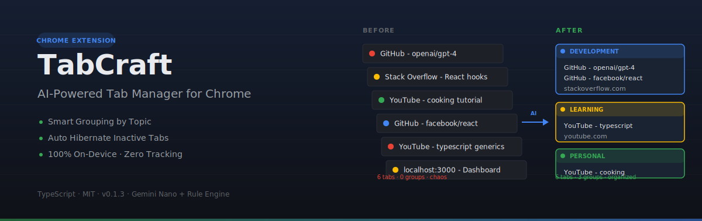
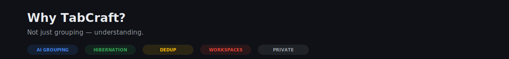

<p align="center">
  
</p>

<p align="center">
  
  
  
  
  
</p>

<p align="center">
  <strong>Smart tabs, zero clutter.</strong><br>
  AI understands what each tab is about — not just the URL.
</p>

---

## What is TabCraft?

TabCraft is a **fully open-source** Chrome extension that automatically organizes, manages, and cleans up your browser tabs using on-device AI. No account, no server, no tracking — everything runs locally in your browser.

### Why another tab manager?

Most tab managers just group by domain. TabCraft understands what each tab is **actually about** by reading the page title and content. A localhost page called "Investment Dashboard" goes into an **Investment** group, not a **Dev** group.

---

<p align="center">
  
</p>

| Feature | What it does |
|---------|-------------|
| **🤖 AI Smart Grouping** | Groups tabs by topic using on-device AI (Gemini Nano) with rule-based fallback |
| **📦 Batch Classification** | Classifies many tabs in a single AI call, with per-tab fallback |
| **↩️ Undo Grouping** | One-click restore of the layout before the last Smart Group |
| **🧠 Self-Learning** | Learns domain→group mappings from your manual grouping (opt-in) |
| **📋 Domain Rules** | 390+ built-in rules, fully editable, import/export |
| **🔍 Duplicate Detection** | Smart URL matching that ignores tracking parameters |
| **💤 Tab Hibernation** | Auto-suspend inactive tabs to save up to 95% memory |
| **🗂️ Workspaces** | Save and restore named snapshots of your tabs |
| **🎨 Side Panel UI** | Modern glassmorphism interface with dark/light mode |
| **🔒 100% Private** | All processing runs locally. Zero data leaves your browser |

> 📖 **New here? Read the [full usage guide → USAGE.md](USAGE.md)** — install, every button, settings, keyboard shortcuts, and how to enable on-device AI.

### Coming Soon

- Tab Snooze (close now, reopen later)
- Multi-AI backend (Gemini Nano + Ollama + OpenAI)
- Firefox support

---

## How it works

```
┌─────────────────────────────────────────────────────────────┐
│                       Chrome Tab                             │
│  ┌──────────────┐       ┌─────────────────────────────┐     │
│  │  Side Panel   │◄─────►│      Service Worker         │     │
│  │  (React UI)   │       │       (Background)          │     │
│  └──────────────┘       └────────────┬────────────────┘     │
│                                      │                        │
│                         ┌────────────┼────────────┐          │
│                         ▼            ▼            ▼          │
│                   ┌──────────┐ ┌──────────┐ ┌─────────┐     │
│                   │ Gemini   │ │  Rule    │ │  Tab    │     │
│                   │ Nano AI  │ │  Engine  │ │   API   │     │
│                   └──────────┘ └──────────┘ └─────────┘     │
│                         │            │            │          │
│                         ▼            ▼            ▼          │
│                   ┌──────────────────────────────────────┐  │
│                   │       chrome.storage.local            │  │
│                   │    (Rules, Settings, State)           │  │
│                   └──────────────────────────────────────┘  │
└─────────────────────────────────────────────────────────────┘
```

---

## Getting Started

### Prerequisites

- Node.js 18+
- Chrome 120+ (AI features require Chrome 127+)

### Quick Start

```bash
git clone https://github.com/alloevil/TabCraft.git
cd TabCraft
bash setup.sh
```

The script installs dependencies, builds the extension, and starts the dev server with hot reload.

Then load it in Chrome:

1. Open `chrome://extensions/`
2. Enable **Developer mode**
3. Click **Load unpacked**
4. Select the `build/chrome-mv3-dev/` folder

### Manual Setup

```bash
npm install
npm run dev    # Dev mode (hot reload)
npm run build  # Production build
```

---

## Tech Stack

| Layer | Technology |
|-------|------------|
| **Framework** | [Plasmo](https://plasmo.com/) — Browser extension framework |
| **Language** | TypeScript |
| **UI** | React + Tailwind CSS |
| **AI** | Chrome Built-in AI (Gemini Nano) + local rule engine |
| **Storage** | chrome.storage.local + IndexedDB |

---

## Project Structure

```
src/
├── background/          # Service Worker (MV3)
│   ├── ai/              # AI grouping engines
│   │   ├── gemini-nano.ts
│   │   └── rule-engine.ts
│   ├── tab-manager.ts   # Tab lifecycle management
│   ├── hibernation.ts   # Tab hibernation strategy
│   ├── duplicate.ts     # Duplicate detection
│   └── storage.ts       # Data persistence
├── sidepanel/           # UI panel
│   ├── components/      # React components
│   ├── App.tsx
│   └── index.tsx
├── shared/              # Shared types & utils
│   ├── types.ts
│   └── constants.ts
└── rules/               # Seed domain rules
    └── seed-rules.json
```

---

## Contributing

See [CONTRIBUTING.md](CONTRIBUTING.md) for guidelines.

---

## License

MIT — see [LICENSE](LICENSE) for details.

---

<p align="center">
  Built with ❤️ by the open-source community.
</p>
