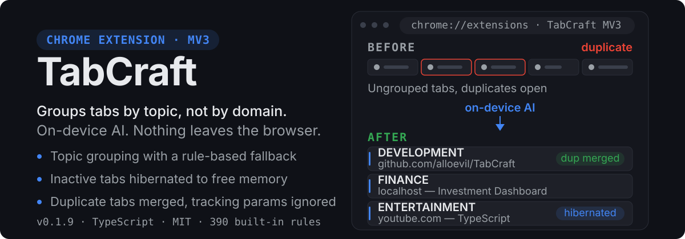
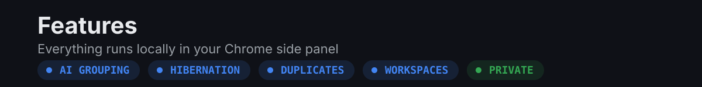

<p align="center">
  
</p>

<p align="center">
  
  
  
  
  
</p>

<p align="center">
  <strong>标签页更聪明，浏览器不再乱。</strong><br>
  AI 真正理解每个标签页在讲什么——而不只是看 URL。
</p>

<p align="center">
  <a href="README.md">English</a> | 简体中文
</p>

---

## TabCraft 是什么？

TabCraft 是一款**完全开源**的 Chrome 扩展，利用端侧 AI 自动整理、管理和清理你的浏览器标签页。无需账号、没有服务器、不做任何跟踪——一切都在你的浏览器本地运行。

### 为什么又造一个标签页管理器？

大多数标签页管理器只会按域名分组。TabCraft 会阅读页面标题和内容，理解每个标签页**实际上在讲什么**。一个标题为 "Investment Dashboard" 的 localhost 页面会被归入**投资**分组，而不是**开发**分组。

---

<p align="center">
  
</p>

| 功能                 | 说明                                                           |
| -------------------- | -------------------------------------------------------------- |
| **🤖 AI 智能分组**   | 使用端侧 AI（Gemini Nano）按主题给标签页分组，并有规则引擎兜底 |
| **📦 批量分类**      | 一次 AI 调用即可分类大量标签页，失败时逐个回退处理             |
| **↩️ 撤销分组**      | 一键恢复到上次智能分组之前的布局                               |
| **🧠 自我学习**      | 从你的手动分组中学习域名→分组的映射（可选开启）                |
| **📋 域名规则**      | 内置 390+ 条规则，完全可编辑，支持导入/导出                    |
| **🔍 重复检测**      | 智能 URL 匹配，自动忽略跟踪参数                                |
| **💤 标签页休眠**    | 自动挂起不活跃的标签页，最多可节省 95% 内存                    |
| **🗂️ 工作区**        | 保存并恢复带名字的标签页快照                                   |
| **🎨 侧边栏界面**    | 现代玻璃拟态（glassmorphism）界面，支持深色/浅色模式           |
| **🛰️ 代理指示器**    | 在每个网页显示该页流量实际走的代理出口节点（需手动开启）       |
| **🔒 100% 隐私保护** | 所有处理均在本地完成，数据绝不离开你的浏览器                   |

> 📖 **第一次用？请阅读[完整使用指南 → USAGE.md](USAGE.md)**——涵盖安装、每个按钮的作用、设置项、键盘快捷键，以及如何启用端侧 AI。

> 🛰️ **代理指示器需要一步配置**：Clash / mihomo 内核必须用 TCP 暴露控制器——只监听
> unix socket 时扩展连不上。具体字段、默认地址 `127.0.0.1:9097`，以及为什么必须设
> secret，见 [USAGE.md](USAGE.md)。

### 即将推出

- 标签页稍后提醒（Tab Snooze，现在关闭、稍后重开）
- 多 AI 后端（Gemini Nano + Ollama + OpenAI）
- Firefox 支持

---

## 工作原理

```
┌─────────────────────────────────────────────────────────────┐
│                       Chrome Tab                             │
│  ┌──────────────┐       ┌─────────────────────────────┐     │
│  │  Side Panel   │◄─────►│      Service Worker         │     │
│  │  (React UI)   │       │       (Background)          │     │
│  └──────────────┘       └────────────┬────────────────┘     │
│                                      │                        │
│                         ┌────────────┼────────────┐          │
│                         ▼            ▼            ▼          │
│                   ┌──────────┐ ┌──────────┐ ┌─────────┐     │
│                   │ Gemini   │ │  Rule    │ │  Tab    │     │
│                   │ Nano AI  │ │  Engine  │ │   API   │     │
│                   └──────────┘ └──────────┘ └─────────┘     │
│                         │            │            │          │
│                         ▼            ▼            ▼          │
│                   ┌──────────────────────────────────────┐  │
│                   │       chrome.storage.local            │  │
│                   │    (Rules, Settings, State)           │  │
│                   └──────────────────────────────────────┘  │
└─────────────────────────────────────────────────────────────┘
```

### 分类管线

每个标签页都会经过一条级联分类管线，按置信度从高到低依次尝试——
只有前面的步骤给不出答案时，后面的步骤才会执行：

1. **已学习的映射**——你之前手动分组过的域名
2. **域名规则**——内置 390+ 条规则（例如 `github.com` → 开发）
3. **多用途域名覆盖**——一小批平台（X、Reddit、YouTube、Bilibili、
   TikTok 等）的内容差异远比域名所暗示的大。对这些平台会跳过域名规则，
   直接依据标签页自身的标题关键词判断，这样 X 上的一条技术讨论帖会被
   归入 AI & ML，而不是一律归为「社交」
4. **URL 路径 / 标题关键词**——当没有任何域名规则匹配时，
   用加权关键词打分作为兜底
5. **端侧 AI（Gemini Nano）**——仅在规则引擎自己也拿不准时才会介入
   （即步骤 3-4 只得出了一个弱猜测），因此高置信度的域名匹配永远不会
   产生 AI 调用开销。如果 AI 给出的低置信度结论与规则引擎的弱猜测一致，
   会被当作相互印证的证据，而不是直接丢弃

---

## 快速上手

> **注意：** TabCraft 尚未上架 Chrome Web Store。请通过**加载已解压的扩展程序**（Load unpacked）本地安装——大约只需一分钟。

### 环境要求

- Node.js 20+（CI 在 20 与 22 上构建；`.nvmrc` 固定推荐版本）
- Chrome 120+（AI 功能需要 Chrome 127+）

### 快速开始

```bash
git clone https://github.com/alloevil/TabCraft.git
cd TabCraft
bash setup.sh
```

该脚本会安装依赖、构建扩展，并启动带热重载的开发服务器。

然后在 Chrome 中加载扩展：

1. 打开 `chrome://extensions/`
2. 启用**开发者模式**（Developer mode）
3. 点击**加载已解压的扩展程序**（Load unpacked）
4. 选择 `build/chrome-mv3-dev/` 目录

> 只想直接使用（不需要开发服务器）？运行 `npm install && npm run build`，然后改为加载 `build/chrome-mv3-prod/` 目录。

### 手动安装

```bash
npm install
npm run dev    # 开发模式（热重载）
npm run build  # 生产构建
```

---

## 技术栈

| 层级     | 技术                                                |
| -------- | --------------------------------------------------- |
| **框架** | [Plasmo](https://plasmo.com/) —— 浏览器扩展开发框架 |
| **语言** | TypeScript                                          |
| **UI**   | React + 纯 CSS（设计变量）                          |
| **AI**   | Chrome 内置 AI（Gemini Nano）+ 本地规则引擎         |
| **存储** | chrome.storage.local + IndexedDB                    |

---

## 项目结构

```
src/
├── background/          # Service Worker (MV3)
│   ├── ai/              # AI 分组引擎
│   │   ├── gemini-nano.ts
│   │   └── rule-engine.ts
│   ├── index.ts         # MV3 入口 —— 所有 chrome.* 监听器
│   ├── tab-manager.ts   # 标签页生命周期管理
│   ├── hibernation.ts   # 标签页休眠策略
│   └── storage.ts       # 数据持久化
├── sidepanel/           # UI 面板
│   ├── components/      # React 组件
│   ├── styles.css       # 手写格式，见 .prettierignore
│   ├── App.tsx
│   └── index.tsx
├── shared/              # 纯逻辑（不依赖 chrome）与共享类型
│   ├── types.ts
│   ├── constants.ts
│   ├── domain.ts        # 域名提取
│   ├── duplicate.ts     # 重复分组与保留页选择
│   └── format.ts        # 字节 / 时长格式化
└── rules/               # 内置域名规则
    └── seed-rules.json
```

---

## 参与贡献

请参阅 [CONTRIBUTING.md](CONTRIBUTING.md) 中的贡献指南。

---

## 许可证

MIT —— 详见 [LICENSE](LICENSE)。

---

<p align="center">
  由开源社区用 ❤️ 打造。
</p>
